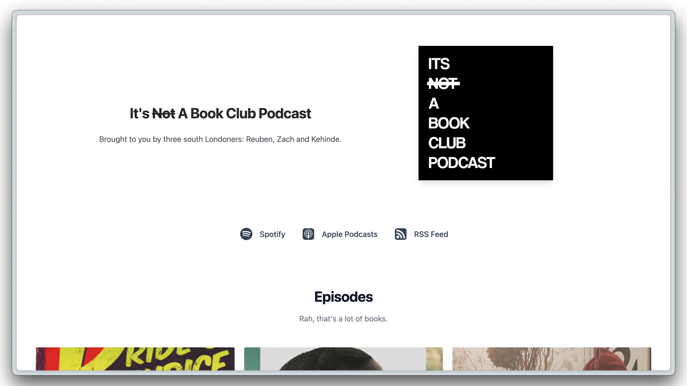

<h1 align="center">A Podcast App built with Next.js</h1>

<h3 align="center">
  <a href="https://inbcp.vercel.app/">See the App</a> 
</h3>



<h2>Installation</h2>

You will need: 
* The repo cloned on your local machine
* Node Package Manager installed

```

// install the dependencies
$ npm install

// run the app in development mode 
$ npm run dev

```

## The Concept

I wanted to build a custom podcast application to display and listen to episodes of the show: It's Not A Book Club Podcast. 

The primary goals was to increase opportunites to collaborate / monetise the podcast by **centralising podcast content and establishing the creator brand**.

## Article 

I wrote an article documenting part of the process of building this application. 

Read it here: [Building a podcast app: Media playback in React](https://www.leahloading.com/articles/building-a-podcast-app-media-playback-in-react)

<h2>Technologies</h2>

This app was built using Next.js and Tailwind CSS / UI.

It was partially inspired by [Transmit](https://transmit.tailwindui.com/), a podcast application built by the creators of Tailwind CSS.


